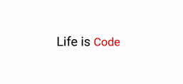

# Vue Simple Typewriter

[Original react component](https://www.npmjs.com/package/react-simple-typewriter)

> A simple vue component for adding a nice typewriter effect to your project

<p align="left">
    
</p>

## Install

#### npm

```sh
npm install react-simple-typewriter
```

#### yarn

```sh
yarn add react-simple-typewriter
```

## Usage

```vue
const data = ref<string[]>(["Eat", "Sleep", "Code"]);

<Typewriter
  :words="data"
  :loop="0"
  :delay-speed="1500"
  :delete-speed="80"
  :type-speed="80"
  :cursor="true"
  :cursor-blinking="true"
  :cursor-style="'|'"
  :cursor-color="'#000000'"
  :on-loop-done="onLoopDone"
  :on-delay="onDelay"
  :on-delete="onDelete"
  :on-type="onType"
  class="text"
/>
```

## Troubleshooting
If you cursor is not blinking, or always shown try to add this css to you project
```css
.blinkingCursor {
  position: relative;
  font: inherit;
  line-height: inherit;
  left: 3px;
  top: 0;
}

.blinking {
  animation-name: blink;
  animation-duration: 0.8s;
  animation-iteration-count: infinite;
}

@keyframes blink {
  0% {
    opacity: 1;
  }

  to {
    opacity: 0;
  }
}
```
### Component Props

| Prop             |       Type        | Options  | Description                                                                                |      Default       |
| ---------------- | :---------------: | -------- | ------------------------------------------------------------------------------------------ | :----------------: |
| `words`          |       array       | Required | Array of strings holding the words                                                         |        `-`         |
| `typeSpeed`      |      number       | Optional | Character typing speed in Milliseconds                                                     |        `80`        |
| `deleteSpeed`    |      number       | Optional | Character deleting speed in Milliseconds                                                   |        `50`        |
| `delaySpeed`     |      number       | Optional | Delay time between the words in Milliseconds                                               |       `1500`       |
| `loop`           |      number       | Optional | Control how many times to run. `0` to run infinitely                                       |        `0`         |
| `cursor`         |      boolean      | Optional | Show / Hide a cursor                                                                       |      `true`        |
| `cursorStyle`    |     string        | Optional | Change the cursor style available if `cursor` is `enabled`                                 |        `_`        |
| `cursorBlinking` |      boolean      | Optional | Enable cursor blinking animation                                                           |        `true`      |
| `onLoopDone`     |     function      | Optional | Callback function that is triggered when loops are completed. available if `loop` is `> 0` |        `-`         |
| `onType`         |     function      | Optional | Callback function that is triggered while typing with typed words `count` passed           |        `-`         |
| `onDelay`        |     function      | Optional | Callback function that is triggered on typing delay                                        |        `-`         |
| `onDelete`       |     function      | Optional | Callback function that is triggered while deleting                                         |        `-`         |
---

### Usage Example

```vue
<script setup lang="ts">
import { ref } from "vue";

import { Typewriter } from "vue-simple-typewriter";
import 'vue-simple-typewriter/dist/style.css';

const data = ref<string[]>(["Eat", "Sleep", "Code"]);

const onLoopDone = () => {
  console.log("loop done");
};
const onDelay = () => {
  console.log("on Delay");
};
const onDelete = () => {
  console.log("on Delete");
};
const onType = () => {
  console.log("on Type");
};
</script>

<template>
  <div>
    <span class="about">Life is </span>
    <Typewriter
      :words="data"
      :loop="0"
      :delay-speed="1500"
      :delete-speed="80"
      :type-speed="80"
      :cursor="true"
      :cursor-blinking="true"
      :cursor-style="'|'"
      :cursor-color="'#000000'"
      :on-loop-done="onLoopDone"
      :on-delay="onDelay"
      :on-delete="onDelete"
      :on-type="onType"
      class="text"
    />
  </div>
</template>

<style scoped>
.text {
  font-size: 48px;
  color: red;
}

.about {
  font-size: 54px;
  color: black;
}
</style>
```
---
### Contributing
This project is developing by enthusiasm, and our coding addiction. This is Open source project, and we will be fine to receive your help. You can take any task you want, just make fork on GitHub. There is a list of issues, todos, call it like you want:
<ul>
<li>Adds hooks api(like in original component)</li>
<li>Fix bug with CSS(need to make importing css unnecessary)</li>
<li>Any bug fix, or new features development</li>
<li>Create right index.d.ts</li>
</ul> 
---

### License

MIT © [danluki](https://github.com/)
